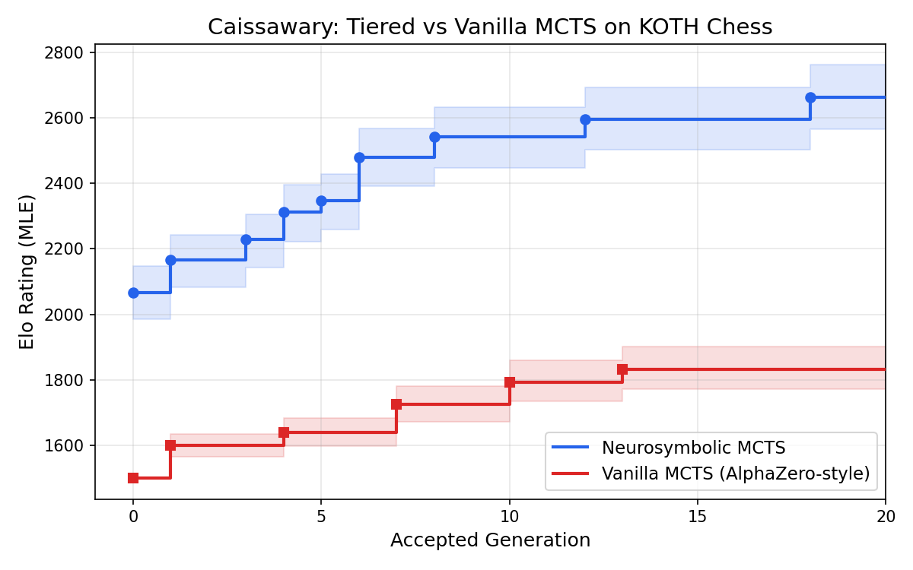

# Caissawary

**Neurosymbolic MCTS with exact subgame resolution for sample-efficient reinforcement learning.**

Caissawary is a chess engine built around the idea that not every position needs a neural network evaluation — its core innovation is a three-tier tactical MCTS that triages positions by complexity. Tier 1 uses provably correct classical methods (checks-only mate search, King of the Hill geometric detection) to resolve forced outcomes with zero NN cost. Tier 2 runs a material-only quiescence search at every leaf node to resolve tactical sequences (captures, promotions), producing a material delta that grounds the evaluation in concrete calculation. Only Tier 3 invokes the neural network, which provides a positional logit and a learned confidence weight *k*, combined as `tanh(v_logit + k * delta_M)` — letting the NN focus on genuinely uncertain, quiet positions while classical search handles what it does best. This hybrid philosophy extends to training: an AlphaZero-style self-play loop with Elo-weighted replay buffers, adaptive epochs, and SPRT gating, where the NN (OracleNet, an SE-ResNet) learns primarily to improve move selection (policy) while deferring much of the value estimation to the material-aware classical backbone.

The key design choice is that classically solved positions become **terminal nodes** — they are never expanded further, so their exact values cannot be diluted by approximate child evaluations. This anti-dilution property is the critical difference from prior approaches like MCTS-Solver (which propagates proven values but doesn't prevent expansion) or KataGo (which incorporates handcrafted features as priors rather than terminal values). The architecture pattern — injecting exact solutions for tractable subproblems as terminal MCTS nodes — generalizes beyond chess to any domain with classically solvable subproblems. The natural next domain is mathematical reasoning, where automated theorem provers can resolve subgoals exactly while a neural policy guides high-level proof search.

The name is a hybrid, like the engine: **Caissa** (the mythical goddess of chess) + **Cassowary** (a large, formidable, and famously aggressive bird).


[](https://rustup.rs/)
[](LICENSE)

## The Approach: Subgame Decomposition for MCTS

| Tier | Mechanism | Property | Cost |
|------|-----------|----------|------|
| **Tier 1** | Safety Gates (checks-only mate search, KOTH geometry) | Provably correct, exact values | ~microseconds |
| **Tier 2** | Quiescence search + MVV-LVA ordering | Classical tree search computes material after forced exchanges | ~microseconds |
| **Tier 3** | Neural network (OracleNet) | Learned positional evaluation for uncertain positions | ~milliseconds |

Gate-resolved nodes are **terminal** — identical to checkmate or stalemate — so proven values propagate through the tree without dilution.

## How It Works

**Tier 1** runs ultra-fast safety gates before expansion: a checks-only mate search (up to mate-in-3) and KOTH geometric pruning. When a gate fires, the node receives an exact cached value and becomes terminal — identical to checkmate/stalemate. An `exhaustive_depth` parameter can optionally enable exhaustive search at shallower depths to catch quiet-first forced mates, but checks-only is sufficient in practice and keeps the node budget low.

**Tier 2** runs `forced_material_balance()` at every leaf: a material-only alpha-beta quiescence search (depth 8) that resolves all forced captures and promotions to compute $\Delta M$ — the true material balance after tactical dust settles — along with a completion flag indicating whether the search resolved naturally or hit the depth limit. This is a classical tree search whose results no neural network can easily replicate, since it explores variable-depth exchange sequences. The completion flag feeds into the $k$ head, letting the NN discount unreliable material when the Q-search couldn't fully resolve. Additionally, captures are visited in MVV-LVA order on first visit (PxQ before QxP), though this is a minor optimization.

**Tier 3** provides the neural component. OracleNet outputs a policy prior over moves (for PUCT selection) and $V_{logit}$ (positional assessment). The Tier 2 and Tier 3 outputs combine in the leaf value function:

$$V_{final} = \tanh(V_{logit} + k \cdot \Delta M)$$

Where $\Delta M$ is from the Tier 2 Q-search, $V_{logit}$ is the NN's positional assessment (unbounded), and $k$ is a learned material confidence scalar. The NN only needs to learn what the Q-search can't compute: piece activity, king safety, pawn structure, and how much to trust material in each position. Without a neural network, the classical fallback uses $V_{logit}=0$, $k=0.5$: $V_{final} = \tanh(0.5 \cdot \Delta M)$ with uniform policy priors.

### OracleNet Architecture

OracleNet is a configurable SE-ResNet (default: 6 blocks, 128 channels, ~2M parameters) with three heads:

- **Policy head:** 4672 logits (AlphaZero encoding)
- **Value head ($V_{logit}$):** Unbounded positional assessment
- **Confidence head ($k$):** Handcrafted features + 5x5 king patches

The $k$ head uses domain knowledge rather than learned convolutions: 12 scalar features (pawn counts, piece counts, queen presence, pawn contacts, castling rights, king rank, and bishop square-color presence for detecting opposite-colored bishop endgames and bishop pair advantage), a Q-search completion flag (indicating whether the depth-8 quiescence search resolved naturally or hit its depth limit — letting $k$ discount unreliable material in deeply tactical positions), plus two 5x5 spatial patches centered on each king, combined via small FC layers (~22k parameters). This lets $k$ reason about king safety, material convertibility, Q-search reliability, and piece-specific endgame dynamics without needing to learn these patterns from scratch.

## Tournament Results: Caissawary vs Vanilla MCTS

An 18-model adaptive round-robin tournament compared two training runs — both using 6 blocks, 128 channels (~2M parameters), trained with 200 MCTS simulations per move, SPRT gating (up to 800 eval games), Muon optimizer (lr=0.02), and adaptive epochs with early stopping:
- **Caissawary** (9 models: gen 0, 1, 3, 4, 5, 6, 8, 12, 18): trained with all three tiers (safety gates + quiescence search + neural network) over 20 generations
- **Vanilla** (9 models: gen 0, 1, 4, 7, 10, 13, 21, 23, 28): trained with KOTH only (no tier 1, no material — pure AlphaZero-style) over 29 generations

Tournament games used 200 simulations per move with proportional-or-greedy move selection (explore base 0.80). Within-type consecutive pairs were pre-seeded from training evaluation data (6,479 games); cross-type ranking was established via bridge matches and adaptive CI-targeted pairing.



| Rank | Model | Elo | 95% CI | Type |
|------|-------|-----|--------|------|
| 1 | tiered_gen18 | 2663 | [2565, 2763] | Caissawary |
| 2 | tiered_gen12 | 2595 | [2502, 2692] | Caissawary |
| 3 | tiered_gen8 | 2542 | [2448, 2633] | Caissawary |
| 4 | tiered_gen6 | 2478 | [2391, 2567] | Caissawary |
| 5 | tiered_gen5 | 2347 | [2260, 2428] | Caissawary |
| 6 | tiered_gen4 | 2312 | [2223, 2395] | Caissawary |
| 7 | tiered_gen3 | 2228 | [2144, 2306] | Caissawary |
| 8 | tiered_gen1 | 2167 | [2082, 2242] | Caissawary |
| 9 | tiered_gen0 | 2068 | [1984, 2148] | Caissawary |
| 10 | vanilla_gen28 | 2038 | [1957, 2111] | Vanilla |
| 11 | vanilla_gen23 | 1996 | [1920, 2063] | Vanilla |
| 12 | vanilla_gen21 | 1866 | [1801, 1933] | Vanilla |
| 13 | vanilla_gen13 | 1833 | [1772, 1902] | Vanilla |
| 14 | vanilla_gen10 | 1794 | [1734, 1859] | Vanilla |
| 15 | vanilla_gen7 | 1726 | [1672, 1781] | Vanilla |
| 16 | vanilla_gen4 | 1639 | [1598, 1684] | Vanilla |
| 17 | vanilla_gen1 | 1600 | [1566, 1636] | Vanilla |
| 18 | vanilla_gen0 | 1500 | (anchor) | Vanilla |

**Key findings:**
- All Caissawary models outrank all vanilla models. Even tiered_gen0 (2068) with a *zero-initialized* NN exceeds vanilla_gen28 (2038), the best vanilla model after 29 generations of training.
- Caissawary gains +595 Elo over 18 accepted generations (gen0→gen18), while vanilla gains +538 Elo over 28 accepted generations (gen0→gen28) — similar NN learning rates, but tiered starts ~570 Elo higher.
- The classical fallback alone ($V_{logit}=0$, $k=0.5$: $V_{final} = \tanh(0.5 \cdot \Delta M)$) provides stronger play than 29 generations of pure NN training.

### Elo Methodology

Ratings are computed via Maximum Likelihood Estimation on the Bradley-Terry model. Each game outcome contributes to the log-likelihood: $\log L = \sum_{\text{pairs}} \left[ s_{ij} \log(E_i) + (n_{ij} - s_{ij}) \log(1 - E_i) \right]$ where $s_{ij}$ is the observed score (wins + draws/2), $n_{ij}$ is the number of games, and $E_i = 1/(1 + 10^{(r_j - r_i)/400})$ is the expected score given ratings $r_i, r_j$. Gradient ascent finds the ratings maximizing this joint probability (2000 iterations, lr=10, mean anchored at 1500). The ± values are 95% bootstrap confidence intervals from 1000 resamples — for each resample, individual games within each pair are drawn with replacement, and MLE Elo is recomputed. Full pairwise results are in [`runs/tournaments/round_robin_800eval/round_robin_results.json`](runs/tournaments/round_robin_800eval/round_robin_results.json).

## Example: Material-Aware Evaluation at Initialization

After White plays 1.b4 (100 MCTS iterations, zero-initialized OracleNet with all logits at 0), Black's root children:

```
  +-----------------+
8 | r n b q k b n r |
7 | p p p p p p p p |
6 | . . . . . . . . |
5 | . . . . . . . . |
4 | . P . . . . . . |
3 | . . . . . . . . |
2 | P . P P P P P P |
1 | R N B Q K B N R |
  +-----------------+
    a b c d e f g h

Move       Visits   Q-value
e7e5           29    +0.239
e7e6           27    +0.274
b8a6            8    +0.289
b8c6            5    +0.185
...            ...      0.000
c7c5            1    -0.462
```

With zero training, the engine already plays intelligently. All four top moves (e5, e6, Na6, Nc6) attack White's hanging b4 pawn — preferring pawn advances over knight moves, since advancing opens a bishop line to b4 while knights on a6/c6 can be chased by b5. Meanwhile 1...c5 is correctly avoided (Q = -0.462) because bxc5 wins a pawn outright. This emerges from the zero-initialized network: with $V_{logit} = 0$ and $k = 0.5$, the value function reduces to $\tanh(0.5 \cdot \Delta M)$ — pure material-aware evaluation via quiescence search, with no training required.

## Training Pipeline

AlphaZero-style loop: self-play → replay buffer → train → export → evaluate → gate (SPRT).

Each generation trains from the latest candidate (accepted or rejected, so incremental learning is preserved), exports, and evaluates against the current best via SPRT (up to 800 games with early stopping). Evaluation uses proportional-or-greedy move selection: with probability $p = 0.80^{(\text{move}-1)}$, sample proportionally from visit counts minus one; otherwise play greedy (most-visited). The $\text{visits}-1$ weighting ensures that a move visited exactly once (and found losing) receives zero sampling weight and can never be selected. This decays from full proportional sampling on move 1 to ~99% greedy by move 20, balancing game diversity against SPRT signal quality. Forced wins are always played deterministically. Evaluation games produce training data by default — both sides' data is ingested into the replay buffer with Elo-based strength tags.

Since evaluation games produce training data, self-play is optional after gen 1. With `--skip-self-play`, the loop becomes: train on buffer → eval (producing new training data) → gate → ingest eval data. Gen 1 always runs self-play to seed the buffer.

Multi-variant training (policy-only, value-only, all-heads in parallel) is available via `--multi-variant` but disabled by default — empirical testing showed policy-only training consistently underperformed, and joint training is stable thanks to the factored value function.

```bash
# Full training loop with KOTH, ramping sims from 100→800 over generations
python python/orchestrate.py --enable-koth \
  --sims-schedule "0:100,5:200,10:400,20:800"

# Ablation: disable Tier 1 safety gates
python python/orchestrate.py --disable-tier1

# Ablation: disable material-aware evaluation (pure AlphaZero)
python python/orchestrate.py --disable-material

# Smaller model for faster iteration (240K params vs 2M default)
python python/orchestrate.py --num-blocks 2 --hidden-dim 64

# Skip self-play after gen 1 (eval games produce training data)
python python/orchestrate.py --skip-self-play

# Adaptive epochs with early stopping (default: up to 10 epochs)
python python/orchestrate.py --max-epochs 10

# Quick smoke test
python python/orchestrate.py \
  --games-per-generation 2 --simulations-per-move 50 \
  --max-epochs 1 --eval-max-games 4 --buffer-capacity 1000
```

Training uses Elo-weighted sampling: each position's weight is proportional to the odds ratio of its model's expected score against the strongest model in the buffer, so max-Elo data is always fully included while weaker data is proportionally downsampled (200 Elo gap → ~32% inclusion, 400 Elo gap → ~10%). The replay buffer accumulates across acceptances — Elo weighting and early stopping handle data staleness without clearing. The number of training epochs is determined adaptively: a 90/10 train/validation split with patience-1 early stopping automatically selects the right epoch count per generation (`--max-epochs` sets the ceiling, default 10). This avoids both underfitting (too few epochs for a large model) and overfitting (too many epochs on a small buffer). The orchestrator uses the Muon optimizer by default. Model architecture is configurable via `--num-blocks` and `--hidden-dim`.

Evaluation uses SPRT (Sequential Probability Ratio Test) with early stopping — clear winners/losers decided in ~30 games, marginal cases use up to 800 (needed for statistical power at the ~84% draw rate typical of self-play). Data augmentation exploits board symmetry: positions without castling rights are expanded into both the original and horizontal flip (2x data), with pawnless endgames getting the full D4 dihedral group (8x data).

## Building and Running

### Prerequisites

```bash
curl --proto '=https' --tlsv1.2 -sSf https://sh.rustup.rs | sh   # Rust
pip install torch numpy python-chess                                # NN (optional)
```

### Build

```bash
cargo build --release                    # Tactical MCTS only
cargo build --release --features neural  # With neural network support
```

### Usage

```bash
./target/release/caissawary  # UCI engine — use with any chess GUI
```

## Testing

~950 tests (700 Rust + 255 Python). See [TESTING.md](TESTING.md) for details.

```bash
cargo test                                        # Fast Rust tests (~50s)
cargo test --features slow-tests                  # Full suite including perft (~200s)
cd python && python -m pytest test_*.py -v        # Python pipeline tests
```

## Binary Targets

| Binary | Description |
|--------|-------------|
| `caissawary` | Main UCI chess engine |
| `self_play` | Self-play data generation with SAN game logs |
| `evaluate_models` | Head-to-head model evaluation with SPRT |
| `round_robin` | Round-robin tournament with per-player tier configs, Elo estimation, and adaptive CI-targeted pairing |
| `mcts_inspector` | MCTS search tree visualization (Graphviz DOT) |
| `verbose_search` | Real-time search narration |
| `verbose_game` | Full game between two classical MCTS agents |
| `benchmark` | Performance testing and NPS measurement |
| `strength_test` | Engine strength assessment |
| `run_experiments` | Ablation studies framework |
| `elo_tournament` | Elo rating estimation (classical engines) |
| `texel_tune` | Evaluation weight optimization |
| `generate_training_data` | Standalone training data generation |

## Further Reading

- [DESIGN_DECISIONS.md](DESIGN_DECISIONS.md) — Scientific journey: what was tried, what failed, and why
- [TESTING.md](TESTING.md) — Test suite documentation and coverage
- [SPRT_GUIDE.md](SPRT_GUIDE.md) — SPRT evaluation methodology

## References

- Silver, D. et al. (2017). ["Mastering Chess and Shogi by Self-Play with a General Reinforcement Learning Algorithm"](https://arxiv.org/abs/1712.01815)
- Tian, Y. et al. (2019). ["ELF OpenGo: An Analysis and Open Reimplementation of AlphaZero"](https://arxiv.org/abs/1902.04522)
- Nasu, Y. (2018). ["Efficiently Updatable Neural-Network-based Evaluation Functions for Computer Shogi"](https://www.apply.computer-shogi.org/wcsc28/appeal/the_end_of_genesis_T.N.K.evolution_turbo_type_D/nnue.pdf)
- [Leela Chess Zero](https://lczero.org/) — Open-source neural network chess engine
- [Stockfish](https://stockfishchess.org/) — State-of-the-art classical + NNUE engine
- [Berserk](https://github.com/jhonnold/berserk) — Strong open-source engine with NNUE
- [Chess Programming Wiki](https://www.chessprogramming.org/) — Encyclopedic reference for chess engine techniques

## License

MIT License. See [LICENSE](LICENSE) for details.
