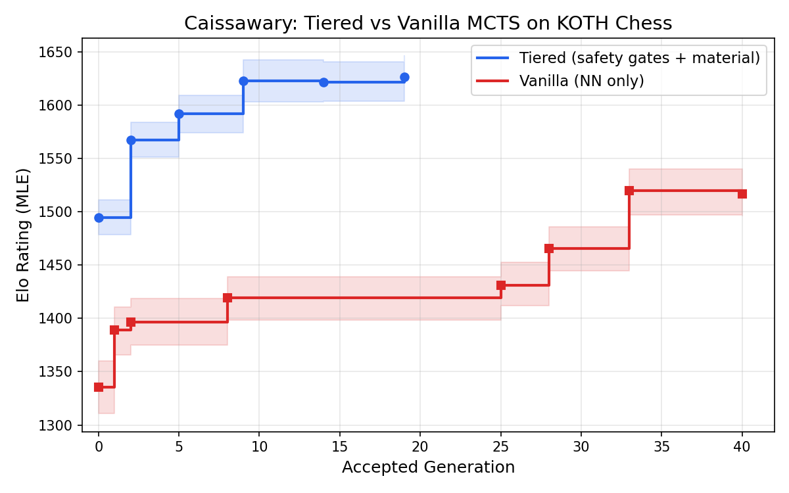

# Caissawary

**Neurosymbolic MCTS with exact subgame resolution for sample-efficient reinforcement learning.**

Caissawary decomposes MCTS positions into tractable subgames solved exactly by classical methods and uncertain residuals evaluated by a neural network. When a subproblem is tractable, the engine computes the answer exactly rather than learning it — injecting provably correct values directly into the search tree as terminal nodes. This reduces the sample complexity of self-play RL by reserving neural network queries for genuinely uncertain positions. The architecture pattern — injecting exact solutions for tractable subproblems as terminal MCTS nodes — applies wherever a domain has subproblems solvable by classical methods. The natural next domain is mathematical reasoning, where automated theorem provers can resolve subgoals exactly while a neural policy guides high-level proof search. Demonstrated here on chess and King of the Hill (KOTH).

Prior work has explored parts of this space — KataGo incorporates handcrafted features alongside neural evaluation, and MCTS-Solver propagates proven game-theoretic values through the tree — but no existing system combines provably correct terminal nodes (with anti-dilution semantics), heuristic move ordering, and a factored value function where learned and computed components interact through a position-dependent confidence scalar.

The name is a hybrid, like the engine: **Caissa** (the mythical goddess of chess) + **Cassowary** (a large, formidable, and famously aggressive bird).


[](https://rustup.rs/)
[](LICENSE)

## The Approach: Subgame Decomposition for MCTS

| Tier | Mechanism | Property | Cost |
|------|-----------|----------|------|
| **Tier 1** | Safety Gates (mate search, KOTH geometry) | Provably correct, exact values | ~microseconds |
| **Tier 2** | MVV-LVA tactical move ordering | Prioritizes good captures on first visit | Zero (integer scores) |
| **Tier 3** | Neural network (OracleNet) | Learned evaluation for uncertain positions | ~milliseconds |

The key insight: gate-resolved nodes are **terminal** — they are never expanded, so proven values cannot be diluted by approximate child evaluations. This is the critical difference from using exact values as priors.

## How It Works

**Tier 1** runs ultra-fast safety gates before expansion: a checks-only mate search and KOTH geometric pruning. When a gate fires, the node receives an exact cached value and becomes terminal — identical to checkmate/stalemate.

**Tier 2** orders capture/promotion children by MVV-LVA scores on their first visit (e.g., PxQ = 39 is visited before QxP = 5). This is purely visit ordering — no Q-values are initialized. After the first visit, normal UCB selection takes over.

**Tier 3** evaluates leaf nodes with a factored value function (the symbolic component is classical chess algorithms — material-only quiescence search and piece values — not a formal system):

$$V_{final} = \tanh(V_{logit} + k \cdot \Delta M)$$

Where $V_{logit}$ is the NN's positional assessment (unbounded), $k$ is a learned material confidence scalar, and $\Delta M$ is the material balance after forced captures computed by `forced_material_balance()`. The NN also provides a policy prior over moves, cached on each node after evaluation and used for PUCT selection on subsequent visits. Without a neural network, the classical fallback uses $V_{logit}=0$, $k=0.5$: $V_{final} = \tanh(0.5 \cdot \Delta M)$ with uniform policy priors.

### OracleNet Architecture

OracleNet is a configurable SE-ResNet (default: 6 blocks, 128 channels, ~2M parameters) with three heads:

- **Policy head:** 4672 logits (AlphaZero encoding)
- **Value head ($V_{logit}$):** Unbounded positional assessment
- **Confidence head ($k$):** Handcrafted features + 5x5 king patches

The $k$ head uses domain knowledge rather than learned convolutions: 12 scalar features (pawn counts, piece counts, queen presence, pawn contacts, castling rights, king rank, and bishop square-color presence for detecting opposite-colored bishop endgames and bishop pair advantage) plus two 5x5 spatial patches centered on each king, combined via small FC layers (~21.8k parameters). This lets $k$ reason about king safety, material convertibility, and piece-specific endgame dynamics without needing to learn these patterns from scratch.

## Tournament Results: Tiered vs Vanilla

A 14-model round-robin tournament compared two training runs using the same small architecture (2 blocks, 64 channels, ~240K parameters):
- **Tiered** (6 models): trained with all three tiers (safety gates + material + KOTH)
- **Vanilla** (8 models): trained with KOTH only (no tier 1, no material — pure AlphaZero-style)

Each pair played 30 games at 100 MCTS simulations per move (C(14,2) = 91 pairs, 2,730 total games). Move selection used proportional sampling for the first 10 plies and greedy (most-visited child) thereafter.



| Rank | Model | Elo | Type |
|------|-------|-----|------|
| 1 | tiered_gen19 | 1627 ± 19 | Tiered |
| 2 | tiered_gen9 | 1623 ± 20 | Tiered |
| 3 | tiered_gen14 | 1622 ± 18 | Tiered |
| 4 | tiered_gen5 | 1592 ± 17 | Tiered |
| 5 | tiered_gen2 | 1567 ± 17 | Tiered |
| 6 | vanilla_gen33 | 1520 ± 21 | Vanilla |
| 7 | vanilla_gen40 | 1517 ± 21 | Vanilla |
| 8 | tiered_gen0 | 1495 ± 16 | Tiered |
| 9 | vanilla_gen28 | 1466 ± 21 | Vanilla |
| 10 | vanilla_gen25 | 1431 ± 20 | Vanilla |
| 11 | vanilla_gen8 | 1419 ± 21 | Vanilla |
| 12 | vanilla_gen2 | 1397 ± 22 | Vanilla |
| 13 | vanilla_gen1 | 1389 ± 23 | Vanilla |
| 14 | vanilla_gen0 | 1336 ± 25 | Vanilla |

**Key findings:**
- All five trained tiered models outrank all vanilla models. Even tiered_gen2 (1567) beats vanilla_gen33 (1520), the best vanilla model after 33 accepted generations.
- Vanilla training improved substantially (+184 Elo from gen0 to gen33), but the tiered system's classical components provide a head start that pure NN training cannot overcome with this architecture and compute budget.
- Tiered training plateaus early: gen9 (1623) through gen19 (1627) are statistically indistinguishable, suggesting the safety gates and material evaluation front-load much of the playing strength.
- tiered_gen0 (1495), with a *zero-initialized* NN, already outperforms all vanilla models through gen8 (1419). The classical fallback $\tanh(0.5 \cdot \Delta M)$ alone provides meaningful play.

### Elo Methodology

Ratings are computed via Maximum Likelihood Estimation on the Bradley-Terry model. Each game outcome contributes to the log-likelihood: $\log L = \sum_{\text{pairs}} \left[ s_{ij} \log(E_i) + (n_{ij} - s_{ij}) \log(1 - E_i) \right]$ where $s_{ij}$ is the observed score (wins + draws/2), $n_{ij}$ is the number of games, and $E_i = 1/(1 + 10^{(r_j - r_i)/400})$ is the expected score given ratings $r_i, r_j$. Gradient ascent finds the ratings maximizing this joint probability (2000 iterations, lr=10, mean anchored at 1500). The ± values are 95% bootstrap confidence intervals from 1000 resamples — for each resample, individual games within each pair are drawn with replacement, and MLE Elo is recomputed. Full pairwise results are in [`tournament_results_14way.csv`](tournament_results_14way.csv).

## Example: Material-Aware Evaluation at Initialization

After White plays 1.b4 (100 MCTS iterations, zero-initialized OracleNet with all logits at 0), Black's root children:

```
  +-----------------+
8 | r n b q k b n r |
7 | p p p p p p p p |
6 | . . . . . . . . |
5 | . . . . . . . . |
4 | . P . . . . . . |
3 | . . . . . . . . |
2 | P . P P P P P P |
1 | R N B Q K B N R |
  +-----------------+
    a b c d e f g h

Move       Visits   Q-value
e7e5           29    +0.239
e7e6           27    +0.274
b8a6            8    +0.289
b8c6            5    +0.185
...            ...      0.000
c7c5            1    -0.462
```

With zero training, the engine already plays intelligently. All four top moves (e5, e6, Na6, Nc6) attack White's hanging b4 pawn — preferring pawn advances over knight moves, since advancing opens a bishop line to b4 while knights on a6/c6 can be chased by b5. Meanwhile 1...c5 is correctly avoided (Q = -0.462) because bxc5 wins a pawn outright. This emerges from the zero-initialized network: with $V_{logit} = 0$ and $k = 0.5$, the value function reduces to $\tanh(0.5 \cdot \Delta M)$ — pure material-aware evaluation via quiescence search, with no training required.

## Training Pipeline

AlphaZero-style loop: self-play → replay buffer → train → export → evaluate → gate (SPRT).

Each generation trains all heads jointly, exports the candidate, and evaluates it against the current best via SPRT (up to 400 games with early stopping). Evaluation uses greedy move selection (most-visited child) after the first 10 plies, with proportional sampling only in the opening for diversity. Evaluation games also produce training data by default — each move's MCTS visit counts and material balance are recorded and fed back into the replay buffer. If the candidate is accepted, both sides' data is kept; if rejected, only the current model's data is retained (the candidate may be overfit).

Since evaluation games produce training data, self-play is optional after gen 1. With `--skip-self-play`, the loop becomes: train on buffer → eval (producing new training data) → gate → ingest eval data. Gen 1 always runs self-play to seed the buffer.

Multi-variant training (policy-only, value-only, all-heads in parallel) is available via `--multi-variant` but disabled by default — empirical testing showed policy-only training consistently underperformed, and joint training is stable thanks to the factored value function.

```bash
# Full training loop with KOTH, ramping sims from 100→800 over generations
python python/orchestrate.py --enable-koth \
  --sims-schedule "0:100,5:200,10:400,20:800"

# Ablation: disable Tier 1 safety gates
python python/orchestrate.py --disable-tier1

# Ablation: disable material-aware evaluation (pure AlphaZero)
python python/orchestrate.py --disable-material

# Smaller model for faster iteration (240K params vs 2M default)
python python/orchestrate.py --num-blocks 2 --hidden-dim 64

# Skip self-play after gen 1 (eval games produce training data)
python python/orchestrate.py --skip-self-play

# Quick smoke test
python python/orchestrate.py \
  --games-per-generation 2 --simulations-per-move 50 \
  --minibatches-per-gen 10 --eval-max-games 4 --buffer-capacity 1000
```

The orchestrator supports adaptive minibatch scaling (~3 epochs per generation), Elo-based strength weighting for the replay buffer, and Muon optimizer by default. Model architecture is configurable via `--num-blocks` and `--hidden-dim`.

Evaluation uses SPRT (Sequential Probability Ratio Test) with early stopping — clear winners/losers decided in ~30 games, marginal cases use up to 400 (needed for statistical power at the ~84% draw rate typical of self-play). Data augmentation exploits board symmetry: positions without castling rights are expanded into both the original and horizontal flip (2x data), with pawnless endgames getting the full D4 dihedral group (8x data).

## Building and Running

### Prerequisites

```bash
curl --proto '=https' --tlsv1.2 -sSf https://sh.rustup.rs | sh   # Rust
pip install torch numpy python-chess                                # NN (optional)
```

### Build

```bash
cargo build --release                    # Tactical MCTS only
cargo build --release --features neural  # With neural network support
```

### Usage

```bash
./target/release/caissawary  # UCI engine — use with any chess GUI
```

## Testing

~830 tests (660 Rust + 175 Python). See [TESTING.md](TESTING.md) for details.

```bash
cargo test                                        # Fast Rust tests (~50s)
cargo test --features slow-tests                  # Full suite including perft (~200s)
cd python && python -m pytest test_*.py -v        # Python pipeline tests
```

## Binary Targets

| Binary | Description |
|--------|-------------|
| `caissawary` | Main UCI chess engine |
| `self_play` | Self-play data generation with SAN game logs |
| `evaluate_models` | Head-to-head model evaluation with SPRT |
| `round_robin` | Round-robin tournament with per-player tier configs and Elo estimation |
| `mcts_inspector` | MCTS search tree visualization (Graphviz DOT) |
| `verbose_search` | Real-time search narration |
| `verbose_game` | Full game between two classical MCTS agents |
| `benchmark` | Performance testing and NPS measurement |
| `strength_test` | Engine strength assessment |
| `run_experiments` | Ablation studies framework |
| `elo_tournament` | Elo rating estimation (classical engines) |
| `texel_tune` | Evaluation weight optimization |
| `generate_training_data` | Standalone training data generation |

## Further Reading

- [DESIGN_DECISIONS.md](DESIGN_DECISIONS.md) — Scientific journey: what was tried, what failed, and why
- [TESTING.md](TESTING.md) — Test suite documentation and coverage
- [SPRT_GUIDE.md](SPRT_GUIDE.md) — SPRT evaluation methodology

## References

- Silver, D. et al. (2017). ["Mastering Chess and Shogi by Self-Play with a General Reinforcement Learning Algorithm"](https://arxiv.org/abs/1712.01815)
- Tian, Y. et al. (2019). ["ELF OpenGo: An Analysis and Open Reimplementation of AlphaZero"](https://arxiv.org/abs/1902.04522)
- Nasu, Y. (2018). ["Efficiently Updatable Neural-Network-based Evaluation Functions for Computer Shogi"](https://www.apply.computer-shogi.org/wcsc28/appeal/the_end_of_genesis_T.N.K.evolution_turbo_type_D/nnue.pdf)
- [Leela Chess Zero](https://lczero.org/) — Open-source neural network chess engine
- [Stockfish](https://stockfishchess.org/) — State-of-the-art classical + NNUE engine
- [Berserk](https://github.com/jhonnold/berserk) — Strong open-source engine with NNUE
- [Chess Programming Wiki](https://www.chessprogramming.org/) — Encyclopedic reference for chess engine techniques

## License

MIT License. See [LICENSE](LICENSE) for details.
