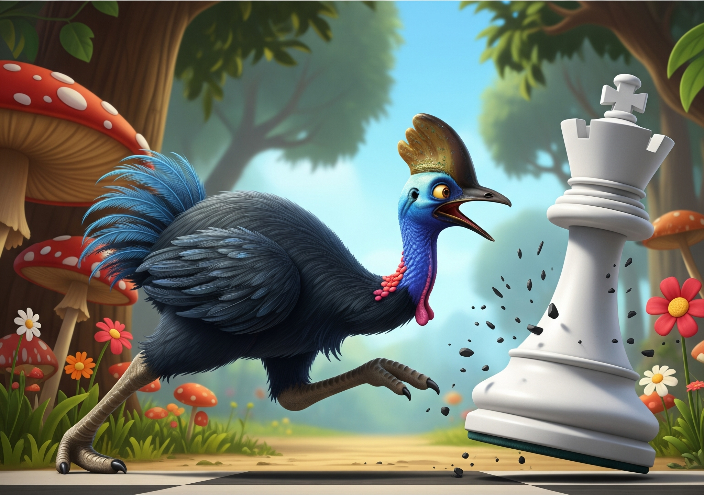

# Caissawary
## Sample-Efficient MCTS via Provably Correct Subgame Solving

Caissawary is a research chess engine that decomposes positions into **tractable tactical subgames** solved exactly by classical search and **uncertain strategic residuals** evaluated by a neural network. When a subproblem is tractable, the engine proves the answer rather than learning it -- injecting ground-truth values directly into the MCTS tree. This reduces the sample complexity of self-play reinforcement learning by reserving neural network queries for positions where exact analysis is infeasible. The engine includes a full AlphaZero-style training pipeline and is applied to **King of the Hill** (KOTH) chess, a variant where either checkmate or moving your king to a central square wins the game.



[](https://rustup.rs/)
[](LICENSE)

### The Name
Like the engine itself, the name Caissawary is a hybrid:

- **Caissa**: The mythical goddess of chess, representing the engine's strategic intelligence and artistry.
- **Cassowary**: A large, formidable, and famously aggressive bird, representing the engine's raw tactical power and speed.

## Research: Sample-Efficient RL via Subgame Decomposition

Caissawary explores **how provably correct subroutines reduce the sample complexity of reinforcement learning**. The key insight: many RL domains contain tractable subproblems where exact analysis outperforms learned approximations.

### The Three-Tier Hypothesis

| Tier | Mechanism | Property |
|------|-----------|----------|
| **Tier 1** | Safety Gates | Provably correct in forced situations |
| **Tier 2** | MVV-LVA Q-init | Prioritizes good captures via UCB without NN overhead |
| **Tier 3** | Neural Networks | Handles genuinely uncertain positions |

### Running Experiments

```bash
# Full ablation study
cargo run --release --bin run_experiments -- --config ablation

# Generate publication figures
python scripts/analyze_results.py results/ablation_results.json
```

See [RESEARCH.md](RESEARCH.md) for full methodology and analysis.

## Architecture
Caissawary's intelligence stems from how it handles each node during an MCTS traversal. Instead of a single, uniform approach, its behavior adapts based on the node's state, ensuring that cheap, powerful analysis is always performed before expensive strategic evaluation.

### The MCTS Node Handling Flow
When the MCTS search selects a node, its state determines the next action:

#### 1. Safety Gates (Tier 1):
Before any expansion, the engine runs ultra-fast "Safety Gates" to detect immediate win/loss conditions:
- **Checks-Only Mate Search:** A depth-limited DFS that only considers checking moves. It instantly spots forced mate sequences (like Mate-in-2) that standard MCTS might miss due to low visit counts.
- **KOTH Geometric Gate:** A geometric pruning algorithm that detects if a King can reach the center (King of the Hill win) within 3 moves faster than the opponent.

**Gate-resolved nodes are terminal.** When a Safety Gate fires, it caches the exact value in the node and the node is never expanded (no children are created). This is critical: if the node were expanded, subsequent MCTS visits would descend into children evaluated by approximate methods (classical eval or NN), diluting the proven value toward zero. By treating gate-resolved nodes identically to checkmate/stalemate, every future visit re-uses the cached value, keeping Q-values exact.

#### 2. MVV-LVA Q-init (Tier 2):
When a node is expanded, capture/promotion children receive MVV-LVA scores as Q-init values:
- **MVV-LVA Scoring:** Each capture is scored as `10*victim - attacker` (e.g., PxQ = 39, QxP = 5), normalized to [-1, 1] by dividing by 50.
- **UCB Prioritization:** These normalized scores serve as initial Q-values for unvisited capture children in UCB selection, so good captures (like PxQ) are explored before bad ones (like QxP).
- **No Q-Search at Expansion:** Unlike the previous grafting approach, this adds zero cost at expansion time — just a simple integer score per capture.

#### 3. Material-Aware Strategic Evaluation (Tier 3):
Every leaf node's value is computed as:

$$V_{final} = \tanh(V_{logit} + k \cdot \Delta M)$$

Where:
- **$V_{logit}$** = the neural network's raw positional logit (unbounded, learns only positional factors)
- **$k$** = the network's material confidence scalar
- **$\Delta M$** = material balance after forced captures/promotions, computed by `forced_material_balance()` — a material-only quiescence search using piece values (P=1, N=3, B=3, R=5, Q=9) with no Pesto positional terms

The NN outputs raw $V_{logit}$ at inference time (not `tanh`), while the Rust engine computes $\Delta M$ via material Q-search and applies the final `tanh`. This separation allows the engine to use an enhanced material evaluation (resolving tactical exchanges) that the NN never sees during training. Without a neural network, the engine falls back to a purely material-based evaluation: $V_{logit} = 0$, $k = 0.5$ (matching the NN initialization where $\text{Softplus}(0)/(2\ln 2) \approx 0.5$), $V_{final} = \tanh(0.5 \cdot \Delta M)$.

## Tier 2: MVV-LVA Q-init
Instead of treating all new children as equal, Caissawary injects capture ordering knowledge at expansion time using MVV-LVA (Most Valuable Victim - Least Valuable Attacker) scores. This lightweight approach gives UCB selection immediate information about which captures are likely good, without any expensive Q-search or NN call at expansion time. The material dynamics are fully handled by the leaf value function: $\tanh(V_{logit} + k \cdot \Delta M)$.

## Tier 3: LogosNet Architecture (Optional)
The engine supports a **Neurosymbolic** mode using the LogosNet architecture.

- **Architecture:** A 6-block SE-ResNet backbone with a standard Policy head and a **Symbolic Residual Value Head**.
- **Dynamic K:** The network learns how much to trust material imbalance. At initialization ($K_{net} = 0$), $k$ is exactly $0.5$. During training, the network adjusts $k$ to prioritize material or strategic compensation.
- **Inference:** Uses **tch-rs** (LibTorch) for high-performance inference. At inference time, the model returns raw $V_{logit}$ (unbounded) and $k$, leaving the Rust engine to compute $\Delta M$ via material Q-search and apply the final $\tanh$.
- **Training:** During training, the model internally computes $\tanh(V_{logit} + k \cdot M)$ against game outcome targets, where $M$ is the simple material imbalance. The Rust side uses the enhanced $\Delta M$ from `forced_material_balance()` which resolves forced captures.

### Final Layer Details
The value head splits into two paths to predict the final evaluation:

1.  **Deep Value Logit ($V_{logit}$):** The network's positional assessment in logit space (unbounded). Learns only positional factors, never material directly.
2.  **Confidence Scalar ($k$):** Determines how much material matters in this position.

These are combined using the **Dynamic Symbolic Residual Formula**:

$$k = \frac{\text{Softplus}(K_{net})}{2 \ln 2}$$

$$V_{final} = \tanh(V_{logit} + k \cdot \Delta M)$$

Where $\Delta M$ is the material balance after forced captures/promotions (computed by `forced_material_balance()` in Rust). This separation allows the NN to focus on positional learning while the Rust engine handles tactical material resolution exactly.

> **Note:** Neural network support is optional. Compile with `cargo build --features neural` to enable it. You must have a compatible LibTorch installed or let `tch-rs` download one.

## Training Pipeline

Caissawary includes a full **AlphaZero-style training loop** designed for single-machine training. The hypothesis is that the 3-tier symbolic system converges on much less compute than standard AlphaZero.

### AlphaZero Training Loop

The orchestrator (`python/orchestrate.py`) runs a config-driven loop:

1. **Self-Play** -- Generate games with the current best model via the Rust `self_play` binary
2. **Replay Buffer** -- Add games to a disk-backed FIFO buffer (`python/replay_buffer.py`), evict oldest when over capacity
3. **Train** -- Sample minibatches from the buffer, update the network
4. **Export** -- Trace model to TorchScript for Rust inference
5. **Evaluate** -- Play head-to-head games between candidate and current best (`evaluate_models` binary)
6. **Gate** -- Accept candidate only if win rate exceeds threshold (default 55%)

```bash
# Run the full AlphaZero loop with default settings
python python/orchestrate.py

# Customize for faster iteration
python python/orchestrate.py \
  --games-per-generation 500 \
  --simulations-per-move 800 \
  --minibatches-per-gen 1000 \
  --eval-games 100 \
  --optimizer muon \
  --buffer-capacity 500000

# Run exactly 5 generations then stop
python python/orchestrate.py --max-generations 5 --enable-koth

# Smoke test (tiny settings)
python python/orchestrate.py \
  --games-per-generation 2 \
  --simulations-per-move 50 \
  --minibatches-per-gen 10 \
  --eval-games 4 \
  --buffer-capacity 1000
```

The orchestrator auto-resumes from `orchestrator_state.json` on restart and logs per-generation metrics to `training_log.jsonl`.

### Training Script

The training script (`python/train.py`) supports both epoch-based and minibatch-count modes:

```bash
# Epoch mode (original)
python python/train.py data/training output.pth --optimizer muon --epochs 20

# Minibatch-count mode (AlphaZero-style, samples with replacement from replay buffer)
python python/train.py --buffer-dir data/buffer output.pth --minibatches 1000 --optimizer muon

# With LR scheduling (drop LR at minibatch boundaries)
python python/train.py --buffer-dir data/buffer output.pth \
  --minibatches 5000 --lr-schedule "2000:0.01,4000:0.001"
```

Checkpoints save full training state (model weights, optimizer state, global minibatch count) for seamless resumption. In minibatch mode, intermediate checkpoints are saved every 200 steps and loss metrics are logged every 100 steps.

### Optimizer Selection

| Optimizer | Flag | Default LR | Notes |
|-----------|------|-----------|-------|
| **Adam** | `--optimizer adam` | 0.001 | Standard baseline |
| **AdamW** | `--optimizer adamw` | 0.001 | Decoupled weight decay |
| **Muon** | `--optimizer muon` | 0.02 | Momentum + Newton-Schulz orthogonalization |

[Muon](https://github.com/KellerJordan/modded-nanogpt) applies Newton-Schulz orthogonalization to gradient updates for 2D+ weight tensors (linear, conv layers), falling back to AdamW for 1D parameters (biases, norms). It typically converges faster than Adam on ResNet-style architectures like LogosNet.

### Model Evaluation

The `evaluate_models` binary plays head-to-head matches between two TorchScript models:

```bash
cargo run --release --features neural --bin evaluate_models -- \
  weights/candidate.pt weights/current_best.pt 100 800 --threshold 0.55
```

Output: `WINS=X LOSSES=Y DRAWS=Z WINRATE=0.XX ACCEPTED=true/false`

## Configuration
The search behavior is controlled by `TacticalMctsConfig`, which supports ablation flags for research experiments and training-specific parameters:

```rust
pub struct TacticalMctsConfig {
    pub max_iterations: u32,
    pub time_limit: Duration,
    pub mate_search_depth: i32,
    pub exploration_constant: f64,

    // Ablation flags for paper experiments
    pub enable_tier1_gate: bool,    // Safety Gates (Mate Search + KOTH)
    pub enable_tier3_neural: bool,  // Neural Network Policy
    pub enable_q_init: bool,        // Q-init from tactical values
    pub enable_koth: bool,          // KOTH variant (off for standard chess)

    // Training exploration (AlphaZero-style)
    pub dirichlet_alpha: f64,       // 0.0 = disabled, 0.3 for chess
    pub dirichlet_epsilon: f64,     // 0.0 = disabled, 0.25 for chess
}
```

## Technical Stack
- **Core Logic**: Rust (~10k LOC), for performance, memory safety, and concurrency.
- **Board Representation**: Bitboards with magic bitboard move generation. FxHashMap for fast Zobrist key lookups.
- **Evaluation**: Pesto-style tapered evaluation with Texel-tuned weights (used by alpha-beta search). MCTS uses material-only evaluation via `forced_material_balance()` -- no Pesto dependency.
- **Search**: Alpha-beta with iterative deepening, transposition tables, history heuristic, null move pruning, and quiescence search.
- **MCTS**: Tactical-first MCTS with material-aware value function, lazy policy evaluation, UCB/PUCT selection, tree reuse, and clone-free check detection.
- **Parallelism**: **Rayon** for data parallelism in self-play game generation.
- **Neural Networks** (optional): **PyTorch** for training; **tch-rs** (LibTorch) for Rust inference.
- **Endgame Tablebases**: Syzygy support via **shakmaty-syzygy**.

## Building and Running

### Prerequisites
```bash
# Install Rust and Cargo
curl --proto '=https' --tlsv1.2 -sSf https://sh.rustup.rs | sh
```

For the neural network components (optional):
```bash
pip install torch numpy python-chess
```

### Build
```bash
git clone https://github.com/aaholmes/caissawary.git
cd caissawary

# Standard Build (Tactical MCTS only)
cargo build --release

# Hybrid Build (With Neural Network support)
cargo build --release --features neural
```

### Usage
The primary binary is a UCI-compliant engine, suitable for use in any standard chess GUI (Arena, Cute Chess, BanksiaGUI).

```bash
# Run the engine in UCI mode
./target/release/caissawary
```
(Type `uci` to verify connection)

### Self-Play Data Generation
The self-play pipeline follows AlphaZero-style training practices:
- **Dirichlet noise** at the root node ($\alpha=0.3$, $\epsilon=0.25$) for exploration
- **Proportional move sampling** from visit counts using `visits - 1` (temperature = 1) for game diversity. The subtraction compensates for root exploration widening, which gives every root child exactly 1 forced visit before UCB selection begins. Without the correction, moves that UCB never chose would still have selection probability proportional to their single forced visit, adding noise to the training signal.
- **MCTS tree reuse** between moves for search efficiency
- **Shared transposition table** across moves within a game
- **Draw detection**: 3-fold repetition, 50-move rule, and move limit

```bash
# Generate 100 games with 800 simulations per move, saving to 'data/'
cargo run --release --bin self_play -- 100 800 data

# With a model and KOTH variant enabled
cargo run --release --features neural --bin self_play -- 100 800 data models/latest.pt true
```

## Testing

The project has a comprehensive test suite with **~670 tests** (570 Rust + 100 Python) organized across Rust and Python. For detailed documentation, see [TESTING.md](TESTING.md).

```bash
# Run the fast Rust test suite (<60s, skips perft/property/slow tests)
cargo test

# Run the full suite including slow tests (perft, property, time-limit tests)
cargo test --features slow-tests

# Run unit tests only
cargo test --test unit_tests

# Run integration or regression tests
cargo test --test integration_tests
cargo test --test regression_tests

# Run Python training pipeline tests (100 tests)
cd python && python -m pytest test_replay_buffer.py test_train.py test_orchestrate.py -v
```

The `slow-tests` feature gates perft tests (~187s), property tests (~22s), and a handful of time-limit/game-playing unit tests that run for 10+ seconds each.

### Test Coverage
The unit test suite covers all core modules:

| Module | Tests | Coverage |
|--------|-------|----------|
| Board & FEN parsing | board_tests | Positions, checkmate/stalemate detection, KOTH |
| Board utilities | board_utils_tests | Coordinate conversions, masks, flips |
| Bitwise operations | bits_tests | Iteration, bit manipulation, popcount |
| Move generation | move_generation_tests | Castling, en passant, promotions |
| Move application | make_move_tests | Pawn pushes, en passant, castling, promotion |
| Board stack | boardstack_tests | Make/undo, repetition detection, null moves |
| Evaluation | eval_tests | Material, tapered eval, piece-square, king safety |
| Search | alpha_beta_tests, iterative_deepening_tests | Checkmate detection, depth, time limits |
| Quiescence search | quiescence_tests, see_tests | Captures, SEE pruning, tactical resolution, material Q-search |
| MCTS | node_tests, selection_tests, simulation_tests | UCT/PUCT, playout, node lifecycle |
| MCTS selection | selection_optimization_tests | Redundancy-free selection, UCB correctness |
| Tree reuse | tree_reuse_tests | Subtree extraction, visit preservation |
| Tactical MCTS | tactical_mcts_tests | Mate-in-1, time/iteration limits, MVV-LVA Q-init, KOTH terminal detection, early termination |
| Tactical detection | tactical_detection_tests | Capture/promotion detection, MVV-LVA scoring, cache eviction |
| Mate search | mate_search_tests | Mate-in-1/2, depth, node budgets |
| Check detection | gives_check_tests | Direct/discovered check, property testing |
| Self-play loop | self_play_loop_tests | Repetition, 50-move rule, shared TT |
| Value targets | value_target_tests | STM perspective, checkmate/KOTH/draw outcomes, w_to_move correctness |
| Transposition table | transposition_tests, hash_tests | Store/probe, depth replacement, Zobrist hashing |
| History heuristic | history_tests | Scoring, accumulation, saturation |
| Visualization | graphviz_tests, search_logger_tests | DOT export, verbosity, node coloring |
| KOTH variant | koth_tests | Center square detection, king proximity |
| Training diversity | training_diversity_tests | Dirichlet noise, KOTH gating, game diversity |
| Inference server | inference_server_tests | Mock servers, v_logit returns, batching |
| Model evaluation | evaluate_models_tests | Game termination, color alternation, win rate, acceptance |
| Replay buffer | test_replay_buffer.py | FIFO eviction, manifest persistence, sampling, edge cases |
| Training pipeline | test_train.py | Minibatch mode, LR scheduling, checkpoints, buffer chunking, loss logging |
| Orchestrator | test_orchestrate.py | Config, state persistence, resumability, max generations, subprocess mocking |

## Visualization & Debugging
Caissawary includes a powerful **MCTS Inspector** tool to visualize the search tree and debug its state-dependent logic. This tool generates Graphviz DOT files that color-code nodes based on their origin (Tier 1, 2, or 3).

### Using the MCTS Inspector
```bash
# Analyze a position (defaults to depth 4, 500 iterations)
cargo run --release --bin mcts_inspector -- "rnbqkbnr/pppppppp/8/8/8/8/PPPPPPPP/RNBQKBNR w KQkq - 0 1"

# Customize depth and iteration count
cargo run --release --bin mcts_inspector -- "6k1/5ppp/8/8/8/8/8/4R1K1 w - - 0 1" --depth 6 --iterations 1000 --output mate_search.dot
```

### Rendering the Output
```bash
# Render to PNG
dot -Tpng mcts_tree.dot -o tree.png

# Render to interactive SVG
dot -Tsvg mcts_tree.dot -o tree.svg
```

### Interpreting the Tree
Nodes are color-coded to reveal how the engine solved or evaluated them:
- **Red (Tier 1 Gate):** Solved immediately by "Safety Gates" (Mate Search or KOTH logic) without expansion.
- **Lightblue (Tier 3 Neural):** Evaluated by the neural network or material-only classical fallback.
- **White (Unknown):** Not yet evaluated.

### Stream of Consciousness Logger
For real-time insight into the engine's "thought process," use the **Stream of Consciousness Logger**. This tool narrates the search as it happens, explaining why specific moves are being prioritized.

```bash
cargo run --release --bin verbose_search -- "rnbqkbnr/pppppppp/8/8/8/8/PPPPPPPP/RNBQKBNR w KQkq - 0 1" --verbosity verbose
```

For more details on verbosity levels and configuration, see [STREAM_OF_CONSCIOUSNESS_LOGGER.md](STREAM_OF_CONSCIOUSNESS_LOGGER.md).

### Verbose Game
To watch two classical MCTS agents play a full game with Debug-level output showing every rollout's evaluation cascade:

```bash
# Play a game with 20 iterations/move (default), KOTH enabled, no NN
cargo run --release --bin verbose_game

# Customize iterations and move limit
cargo run --release --bin verbose_game -- --iterations 50 --max-moves 100 --no-emoji
```

**Example: Material-aware evaluation with no trained network.** After White plays 1.b4 (100 iterations, classical fallback only), Black's root children show:

```
  +-----------------+
8 | r n b q k b n r |
7 | p p p p p p p p |
6 | . . . . . . . . |
5 | . . . . . . . . |
4 | . P . . . . . . |
3 | . . . . . . . . |
2 | P . P P P P P P |
1 | R N B Q K B N R |
  +-----------------+
    a b c d e f g h

Move       Visits   Q-value
e7e5           29    +0.239
e7e6           27    +0.274
b8a6            8    +0.289
b8c6            5    +0.185
...            ...      0.000
c7c5            1    -0.462
```

With zero training, the engine already plays intelligently. All four of Black's top moves (e5, e6, Na6, Nc6) attack White's hanging b4 pawn — and it prefers the pawn moves over the knight moves, since advancing the pawn opens a bishop line to b4 while a knight on a6/c6 can be chased by b5. Meanwhile 1...c5 is correctly avoided (Q = -0.462) because bxc5 wins a pawn outright. This all emerges from the material-aware quiescence search in the value function — $\tanh(0.5 \cdot \Delta M)$ with no neural network.

## Binary Targets
The crate produces several binaries for different tasks:

| Binary | Description |
|--------|-------------|
| `caissawary` | Main UCI chess engine |
| `benchmark` | Performance testing and nodes-per-second measurement |
| `mcts_inspector` | MCTS search tree visualization (Graphviz DOT output) |
| `verbose_search` | Real-time search narration with configurable verbosity |
| `verbose_game` | Play a full game between two classical MCTS agents with verbose output |
| `self_play` | Self-play data generation for neural network training |
| `evaluate_models` | Head-to-head model evaluation for AlphaZero gatekeeper |
| `run_experiments` | Ablation studies and experimental framework |
| `elo_tournament` | Elo rating estimation via engine tournaments |
| `texel_tune` | Texel tuning for evaluation weight optimization |
| `strength_test` | Engine strength testing against benchmark positions |
| `generate_training_data` | Training data generation pipeline |
| `quick_test` | Rapid development testing |

## References
The architecture of Caissawary is inspired by decades of research in computer chess and artificial intelligence. Key influences include:

- Silver, D. et al. (2017). "Mastering Chess and Shogi by Self-Play with a General Reinforcement Learning Algorithm"
- Campbell, M. et al. (2002). "Deep Blue"
- The Stockfish Engine and the NNUE architecture.

## License
This project is licensed under the terms of the MIT License. Please see the LICENSE file for details.
