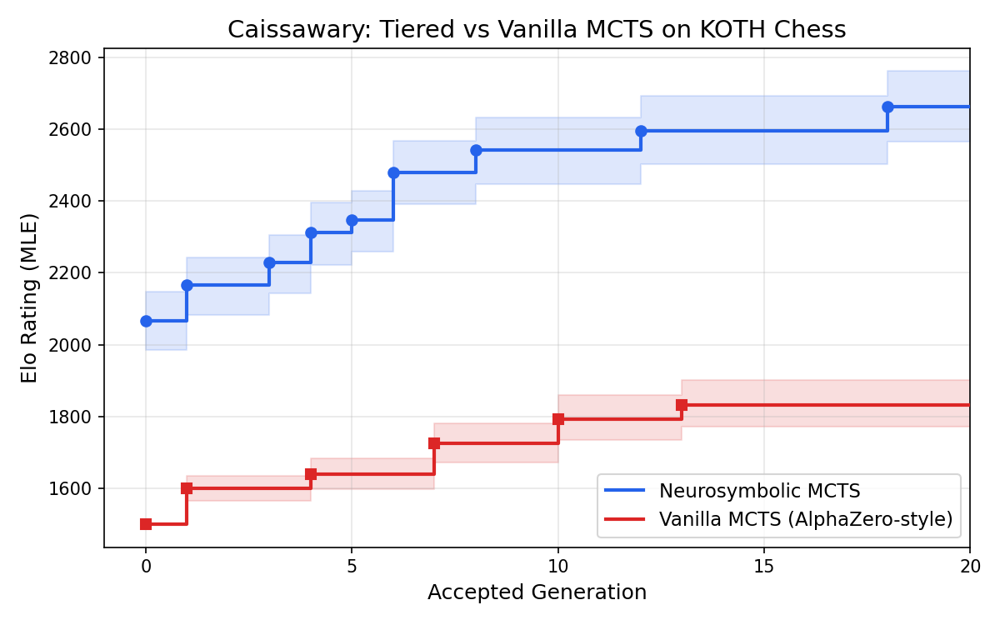

# Caissawary

**Neurosymbolic MCTS with exact subgame resolution for sample-efficient reinforcement learning.**

Caissawary is a chess engine built around the idea that not every position needs a neural network evaluation — its core innovation is a three-tier tactical MCTS that triages positions by complexity. Tier 1 uses provably correct classical methods (checks-only mate search, King of the Hill geometric detection) to resolve forced outcomes with zero NN cost. Tier 2 runs an extended PeSTO piece-square-table quiescence search at every leaf node to resolve tactical sequences (captures, promotions, non-capture checks, and pawn/knight forks), producing a positional+material evaluation that grounds the evaluation in concrete calculation. Only Tier 3 invokes the neural network, which provides a positional logit and a learned confidence scalar *k*, combined as `tanh(v_logit + k * delta_M)` — letting the NN focus on genuinely uncertain, quiet positions while classical search handles what it does best. The Q-search result also feeds directly into the value head as an input feature, giving the NN position-dependent control over material trust. This hybrid philosophy extends to training: an AlphaZero-style self-play loop with Elo-weighted replay buffers, adaptive epochs, and SPRT gating, where the NN (OracleNet, an SE-ResNet) learns primarily to improve move selection (policy) while deferring much of the value estimation to the material-aware classical backbone.

The key design choice is that classically solved positions become **terminal nodes** — they are never expanded further, so their exact values cannot be diluted by approximate child evaluations. This anti-dilution property is the critical difference from prior approaches like MCTS-Solver (which propagates proven values but doesn't prevent expansion) or KataGo (which incorporates handcrafted features as priors rather than terminal values). The architecture pattern — injecting exact solutions for tractable subproblems as terminal MCTS nodes — generalizes beyond chess to any domain with classically solvable subproblems. The natural next domain is mathematical reasoning, where automated theorem provers can resolve subgoals exactly while a neural policy guides high-level proof search.

The name is a hybrid, like the engine: **Caissa** (the mythical goddess of chess) + **Cassowary** (a large, formidable, and famously aggressive bird).


[](https://rustup.rs/)
[](LICENSE)

## The Approach: Subgame Decomposition for MCTS

| Tier | Mechanism | Property | Mean cost |
|------|-----------|----------|-----------|
| **Tier 1** | Safety Gates (mate-in-5, KOTH-in-3) | Provably correct, exact values | 149 us (KOTH-in-3) / 132 us (mate-in-5) |
| **Tier 2** | Iterative-widening quiescence search | PeSTO eval after forced captures, checks, forks, and threat resolution | 8 us |
| **Tier 3** | Neural network (OracleNet) | Learned positional evaluation for uncertain positions | 1,765 us |

Gate-resolved nodes are **terminal** — identical to checkmate or stalemate — so proven values propagate through the tree without dilution.

## How It Works

**Tier 1** runs ultra-fast safety gates before expansion: a checks-only mate search (up to mate-in-5) and KOTH geometric pruning (configurable depth, default center-in-3). When a gate fires, the node receives an exact cached value and becomes terminal — identical to checkmate/stalemate. An `exhaustive_depth` parameter can optionally enable exhaustive search at shallower depths to catch quiet-first forced mates, but checks-only is sufficient in practice and keeps the node budget low.

**Tier 2** runs an iterative-widening PeSTO quiescence search at every leaf to compute $\Delta M$ — the tapered positional+material evaluation after tactical dust settles. The search progressively widens the capture branching factor, giving bounded cost with increasing accuracy:

- **Principal exchange** (cap=0): follow the single best MVV-LVA capture at each node — a straight line, not a tree. Resolves the most forcing exchange sequence in ~1–5 nodes.
- **Cap=1**: add one non-capture checking move per side per branch, plus full check evasions. Catches tactical checks (Nc7+ forking king and rook, back-rank mates) in ~5–90 nodes.
- **Cap=2+**: add null-move threat detection ("deny first choice" — pass the turn, see what the opponent captures, deny their best), pawn/knight fork detection, and mystery-square recapture (the saved piece teleports to recapture the forker, modeling the common fork resolution pattern). This catches forks, hanging pieces, and cross-square tactics in ~50–500 nodes.

The search runs each level in sequence, stopping when a node budget is reached. Stand-pat at every level prevents forced bad captures — in the center fork trick (3.Bc4), the principal exchange correctly rejects 3...Nxe4 (loses a knight for a pawn), and only cap=2+ discovers the d5 fork follow-up that makes the sacrifice profitable.

Unlike simple piece counting, PeSTO uses Texel-tuned piece-square tables (RofChade values) that account for piece placement. The Q-search result feeds directly into the value head as an input feature, letting the NN learn position-dependent modulation of material trust. Captures are visited in MVV-LVA order (PxQ before QxP).

**Tier 3** provides the neural component. OracleNet outputs a policy prior over moves (for PUCT selection) and $V_{logit}$ (positional assessment). The Tier 2 and Tier 3 outputs combine in the leaf value function:

$$V_{final} = \tanh(V_{logit} + k \cdot \Delta M)$$

Where $\Delta M$ is from the Tier 2 Q-search, $V_{logit}$ is the NN's positional assessment (unbounded), and $k$ is a learned scalar that sets a global baseline trust level in material. The value head also receives $\Delta M$ as a direct input feature, enabling position-dependent modulation of material trust through its FC weights. The NN only needs to learn what the Q-search can't compute: piece activity, king safety, pawn structure. Without a neural network, the classical fallback uses $V_{logit}=0$, $k=0.326$: $V_{final} = \tanh(0.326 \cdot \Delta M)$ with uniform policy priors.

### OracleNet Architecture

OracleNet is a configurable SE-ResNet (default: 6 blocks, 128 channels, ~2M parameters) with three heads:

- **Policy head:** 4672 logits (AlphaZero encoding)
- **Value head ($V_{logit}$):** Unbounded positional assessment
- **Confidence scalar ($k$):** Single learned parameter

$k$ is a global learned scalar (`nn.Parameter`), not a per-position neural network. The quiescence search result ($\Delta M$) is fed directly into the value head's FC layer as a 65th input feature, giving the value head the ability to learn position-dependent modulation of the material signal through its existing weights. The scalar $k$ sets a global baseline trust level in material (Texel-calibrated, initialized to 0.326 via $0.47 \cdot \text{softplus}(0) = 0.47 \cdot \ln 2$), while position-dependent adjustments are absorbed by the value head. This design replaced an earlier K-head with handcrafted features and king patches (~22k parameters) — the simplification removes CUDA-hostile dynamic indexing operations while preserving both the additive $k \cdot \Delta M$ path and a learned position-dependent channel through the value FC.

### Search Time Budget

Profiled over 10 self-play games (400 simulations/move, KOTH enabled, gen_18 2M-parameter model on RTX 5060 Ti, proportional move sampling with explore base 0.80):

| Operation | Device | Calls | Mean | Std | Mean nodes | us/node | % of wall time |
|-----------|--------|------:|-----:|----:|-----------:|--------:|---------------:|
| NN inference | GPU | 180,326 | 1,765 us | 823 us | — | — | 84% |
| Mate-in-5 | CPU | 174,495 | 132 us | 481 us | 359 | 0.37 | 6% |
| KOTH-in-3 | CPU | 206,362 | 149 us | 361 us | 780 | 0.19 | 8% |
| Q-search | CPU | 180,326 | 8 us | 15 us | 15 | 0.53 | <1% |

The GPU-resident MCTS kernel eliminates the CPU/GPU split entirely — each block runs the full MCTS loop (select→expand→evaluate→backup) with NN inference inline, no per-simulation CPU↔GPU transfer. With 36 concurrent games on 36 SMs: 200 sims/move completes 36 games in ~7 seconds (transformer) or ~19 ms per move for 400 sims (SE-ResNet). See [GPU MCTS](#gpu-mcts-cuda) for details.

NN inference breaks down into three phases: CPU-to-GPU tensor transfer (49 us), GPU forward pass (1,122 us), and GPU-to-CPU result transfer (41 us). The GPU forward pass dominates at 92% of NN time — transfer overhead is negligible. Mate search uses pure minimax (not alpha-beta) since iterative deepening already finds the shortest mate and within each depth the question is binary: "is there a forced mate?" The solver short-circuits immediately — attacker on first success, defender on first refutation — matching KOTH's `solve_koth` pattern. Five optimizations reduced cost from 1.08 us/node to 0.37 us/node (cumulative 66%): (1) a `gives_check()` pre-filter that skips `make_move` entirely for non-checking moves on attacker plies, (2) converting from stateful `BoardStack` to stateless `&Board` with `apply_move_to_board`, (3) `is_legal_after_move()` before `apply_move_to_board` to avoid cloning the board for illegal pseudo-legal moves, (4) removing atomic node budgets and alpha-beta bookkeeping in favor of a plain counter, and (5) batched per-piece checkmate detection at depth-0 leaves — generating moves by piece type in priority order (king first via direct bitboard, then double-check detection, then knight/bishop/rook/queen/pawn) and aborting as soon as any legal evasion is found, avoiding full movegen in the ~70-80% of leaves where a king move suffices. KOTH-in-3 at 0.19 us/node benefits from direct king-move generation on root-side advancing turns: `k_move_bitboard[king_sq] & target_mask & !friendly_occ` yields exactly the 1-3 valid king destinations without calling `gen_pseudo_legal_moves` at all, skipping the full movegen that would produce ~35 moves only to discard ~30 non-king moves. When the king is already in the target ring, full movegen is used with a post-apply ring check. Q-search is effectively free relative to the other operations, running 220x faster than a single NN call while providing the PeSTO evaluation that grounds every leaf evaluation. Q-search completes naturally 100% of the time with a mean depth of 3.3 (max 20), confirming the depth limit is sufficient.

The `profile_engine` binary reproduces these measurements: `./target/release/profile_engine --model <path> --games 10 --simulations 400 --koth`. Optional `--koth-depth N` (default 3) and `--mate-depth N` (default 5) flags control search depth for profiling deeper configurations.

## Tournament Results: Caissawary vs Vanilla MCTS

An 18-model adaptive round-robin tournament compared two training runs — both using 6 blocks, 128 channels (~2M parameters), trained with 200 MCTS simulations per move, SPRT gating (up to 800 eval games), Muon optimizer (lr=0.02), and adaptive epochs with early stopping:
- **Caissawary** (9 models: gen 0, 1, 3, 4, 5, 6, 8, 12, 18): trained with all three tiers (safety gates + quiescence search + neural network) over 20 generations
- **Vanilla** (9 models: gen 0, 1, 4, 7, 10, 13, 21, 23, 28): trained with KOTH only (no tier 1, no material — pure AlphaZero-style) over 29 generations

Tournament games used 200 simulations per move with proportional-or-greedy move selection (explore base 0.80). Within-type consecutive pairs were pre-seeded from training evaluation data (6,479 games); cross-type ranking was established via bridge matches and adaptive CI-targeted pairing.



| Rank | Model | Elo | 95% CI | Type |
|------|-------|-----|--------|------|
| 1 | tiered_gen18 | 2663 | [2565, 2763] | Caissawary |
| 2 | tiered_gen12 | 2595 | [2502, 2692] | Caissawary |
| 3 | tiered_gen8 | 2542 | [2448, 2633] | Caissawary |
| 4 | tiered_gen6 | 2478 | [2391, 2567] | Caissawary |
| 5 | tiered_gen5 | 2347 | [2260, 2428] | Caissawary |
| 6 | tiered_gen4 | 2312 | [2223, 2395] | Caissawary |
| 7 | tiered_gen3 | 2228 | [2144, 2306] | Caissawary |
| 8 | tiered_gen1 | 2167 | [2082, 2242] | Caissawary |
| 9 | tiered_gen0 | 2068 | [1984, 2148] | Caissawary |
| 10 | vanilla_gen28 | 2038 | [1957, 2111] | Vanilla |
| 11 | vanilla_gen23 | 1996 | [1920, 2063] | Vanilla |
| 12 | vanilla_gen21 | 1866 | [1801, 1933] | Vanilla |
| 13 | vanilla_gen13 | 1833 | [1772, 1902] | Vanilla |
| 14 | vanilla_gen10 | 1794 | [1734, 1859] | Vanilla |
| 15 | vanilla_gen7 | 1726 | [1672, 1781] | Vanilla |
| 16 | vanilla_gen4 | 1639 | [1598, 1684] | Vanilla |
| 17 | vanilla_gen1 | 1600 | [1566, 1636] | Vanilla |
| 18 | vanilla_gen0 | 1500 | (anchor) | Vanilla |

**Key findings:**
- All Caissawary models outrank all vanilla models. Even tiered_gen0 (2068) with a *zero-initialized* NN exceeds vanilla_gen28 (2038), the best vanilla model after 29 generations of training.
- Caissawary gains +595 Elo over 18 accepted generations (gen0→gen18), while vanilla gains +538 Elo over 28 accepted generations (gen0→gen28) — similar NN learning rates, but tiered starts ~570 Elo higher.
- The classical fallback alone ($V_{logit}=0$, $k=0.326$: $V_{final} = \tanh(0.326 \cdot \Delta M)$) provides stronger play than 29 generations of pure NN training.

### Elo Methodology

Ratings are computed via Maximum Likelihood Estimation on the Bradley-Terry model. Each game outcome contributes to the log-likelihood: $\log L = \sum_{\text{pairs}} \left[ s_{ij} \log(E_i) + (n_{ij} - s_{ij}) \log(1 - E_i) \right]$ where $s_{ij}$ is the observed score (wins + draws/2), $n_{ij}$ is the number of games, and $E_i = 1/(1 + 10^{(r_j - r_i)/400})$ is the expected score given ratings $r_i, r_j$. Gradient ascent finds the ratings maximizing this joint probability (2000 iterations, lr=10, mean anchored at 1500). The ± values are 95% bootstrap confidence intervals from 1000 resamples — for each resample, individual games within each pair are drawn with replacement, and MLE Elo is recomputed. Full pairwise results are in [`runs/tournaments/round_robin_800eval/round_robin_results.json`](runs/tournaments/round_robin_800eval/round_robin_results.json).

## Example: Material-Aware Evaluation at Initialization

After White plays 1.b4 (100 MCTS iterations, zero-initialized OracleNet with all logits at 0), Black's root children:

```
  +-----------------+
8 | r n b q k b n r |
7 | p p p p p p p p |
6 | . . . . . . . . |
5 | . . . . . . . . |
4 | . P . . . . . . |
3 | . . . . . . . . |
2 | P . P P P P P P |
1 | R N B Q K B N R |
  +-----------------+
    a b c d e f g h

Move       Visits   Q-value
e7e5           29    +0.239
e7e6           27    +0.274
b8a6            8    +0.289
b8c6            5    +0.185
...            ...      0.000
c7c5            1    -0.462
```

With zero training, the engine already plays intelligently. All four top moves (e5, e6, Na6, Nc6) attack White's hanging b4 pawn — preferring pawn advances over knight moves, since advancing opens a bishop line to b4 while knights on a6/c6 can be chased by b5. Meanwhile 1...c5 is correctly avoided (Q = -0.462) because bxc5 wins a pawn outright. This emerges from the zero-initialized network: with $V_{logit} = 0$ and $k = 0.326$, the value function reduces to $\tanh(0.326 \cdot \Delta M)$ — pure PeSTO-aware evaluation via quiescence search, with no training required.

## Training Pipeline

AlphaZero-style loop: self-play → replay buffer → train → export → evaluate → gate (SPRT).

Each generation trains from the latest candidate (accepted or rejected, so incremental learning is preserved), exports, and evaluates against the current best via SPRT (up to 800 games with early stopping). Evaluation uses proportional-or-greedy move selection: with probability $p = 0.80^{(\text{move}-1)}$, sample proportionally from visit counts minus one; otherwise play greedy (most-visited). The $\text{visits}-1$ weighting ensures that a move visited exactly once (and found losing) receives zero sampling weight and can never be selected. This decays from full proportional sampling on move 1 to ~99% greedy by move 20, balancing game diversity against SPRT signal quality. Forced wins are always played deterministically. Evaluation games produce training data by default — both sides' data is ingested into the replay buffer with Elo-based strength tags.

Since evaluation games produce training data, self-play is optional after gen 1. With `--skip-self-play`, the loop becomes: train on buffer → eval (producing new training data) → gate → ingest eval data. Gen 1 always runs self-play to seed the buffer.

Multi-variant training (policy-only, value-only, all-heads in parallel) is available via `--multi-variant` but disabled by default — empirical testing showed policy-only training consistently underperformed, and joint training is stable thanks to the factored value function.

```bash
# Full training loop with KOTH, ramping sims from 100→800 over generations
python python/orchestrate.py --enable-koth \
  --sims-schedule "0:100,5:200,10:400,20:800"

# Ablation: disable Tier 1 safety gates
python python/orchestrate.py --disable-tier1

# Ablation: disable material-aware evaluation (pure AlphaZero)
python python/orchestrate.py --disable-material

# Smaller model for faster iteration (240K params vs 2M default)
python python/orchestrate.py --num-blocks 2 --hidden-dim 64

# Skip self-play after gen 1 (eval games produce training data)
python python/orchestrate.py --skip-self-play

# Adaptive epochs with early stopping (default: up to 10 epochs)
python python/orchestrate.py --max-epochs 10

# Quick smoke test
python python/orchestrate.py \
  --games-per-generation 2 --simulations-per-move 50 \
  --max-epochs 1 --eval-max-games 4 --buffer-capacity 1000
```

Training uses Elo-weighted sampling: each position's weight is proportional to the odds ratio of its model's expected score against the strongest model in the buffer, so max-Elo data is always fully included while weaker data is proportionally downsampled (200 Elo gap → ~32% inclusion, 400 Elo gap → ~10%). The replay buffer accumulates across acceptances — Elo weighting and early stopping handle data staleness without clearing. The number of training epochs is determined adaptively: a 90/10 train/validation split with patience-1 early stopping automatically selects the right epoch count per generation (`--max-epochs` sets the ceiling, default 10). This avoids both underfitting (too few epochs for a large model) and overfitting (too many epochs on a small buffer). The orchestrator uses the Muon optimizer by default. Model architecture is configurable via `--num-blocks` and `--hidden-dim`.

Evaluation uses SPRT (Sequential Probability Ratio Test) with early stopping — clear winners/losers decided in ~30 games, marginal cases use up to 800 (needed for statistical power at the ~84% draw rate typical of self-play). Data augmentation exploits board symmetry: positions without castling rights are expanded into both the original and horizontal flip (2x data), with pawnless endgames getting the full D4 dihedral group (8x data).

## Building and Running

### Prerequisites

```bash
curl --proto '=https' --tlsv1.2 -sSf https://sh.rustup.rs | sh   # Rust
pip install torch numpy python-chess                                # NN (optional)
```

### Build

```bash
cargo build --release                    # Tactical MCTS only
cargo build --release --features neural  # With neural network support
```

### Usage

```bash
./target/release/caissawary  # UCI engine — use with any chess GUI
```

## Testing

~860 tests (609 Rust + 255 Python). See [TESTING.md](TESTING.md) for details.

```bash
cargo test                                        # Fast Rust tests (~50s)
cargo test --features slow-tests                  # Full suite including perft (~200s)
cd python && python -m pytest test_*.py -v        # Python pipeline tests
```

## Binary Targets

| Binary | Description |
|--------|-------------|
| `caissawary` | Main UCI chess engine |
| `self_play` | Self-play data generation with SAN game logs |
| `evaluate_models` | Head-to-head model evaluation with SPRT |
| `round_robin` | Round-robin tournament with per-player tier configs, Elo estimation, and adaptive CI-targeted pairing |
| `mcts_inspector` | MCTS search tree visualization (Graphviz DOT) |
| `verbose_search` | Real-time search narration |
| `verbose_game` | Full game between two classical MCTS agents |
| `benchmark` | Performance testing and NPS measurement |
| `strength_test` | Engine strength assessment |
| `run_experiments` | Ablation studies framework |
| `elo_tournament` | Elo rating estimation (classical engines) |
| `texel_tune` | Evaluation weight optimization |
| `generate_training_data` | Standalone training data generation |
| `play_engine` | Interactive human-vs-engine play |
| `profile_engine` | Per-operation MCTS timing profiler |
| `qsearch_gui` | Interactive Q-search tree visualizer (web UI at localhost:8088) |

The `--qsearch` flag selects the quiescence search variant: `pe` (principal exchange), `cap1` (captures + checks), or `extended` (full with null-move threat detection). Available in `profile_engine`, `self_play`, and `evaluate_models`.

## GPU MCTS (CUDA)

A fully GPU-resident MCTS implementation in `cuda/`. The entire search loop — tree traversal, node expansion, quick checks, quiescence search, and neural network inference — runs inside a persistent CUDA kernel with no CPU interaction during search. No cuBLAS, no cuDNN, no host round-trips.

### Why GPU-Resident MCTS is Faster

The standard approach (Rust engine + LibTorch) requires a CPU↔GPU round-trip for every NN evaluation: CPU selects a leaf node, copies the position tensor to GPU, runs inference, copies the result back. With batched inference (batch-16 across games), each game must wait for other games to accumulate pending evaluations before a batch can be dispatched. This creates two bottlenecks:

1. **Per-simulation transfer overhead:** Each of ~200 simulations requires a CPU↔GPU data transfer (~90 µs round-trip), adding ~18 ms of transfer time per move on top of inference.
2. **Batching stalls:** Games block each other waiting for a full batch — a game ready for inference must idle until 15 other games also need inference.

The GPU-resident kernel eliminates both: each block runs the complete MCTS loop (select→expand→evaluate→backup) for all simulations in shared memory, with inference called inline as a `__device__` function. The only CPU↔GPU transfer is one `BoardState` upload and one result readback per move (not per simulation). With 36 concurrent games running on 36 SMs, there are no batching stalls — each block runs independently.

### Performance (RTX 5060 Ti, SE-ResNet 6×128)

Single-game sequential profiling with 400 simulations per move:

| Configuration | Per-move time | Note |
|---|---|---|
| CPU MCTS + LibTorch GPU inference | 840 ms | single-game, no batching |
| GPU-resident, 1 block (SE-ResNet TC) | 657 ms | single block, all on GPU |
| GPU-resident, 36 blocks (1 per SM) | 19 ms | 36 concurrent games |

The single-game 840 ms baseline does not reflect the Rust engine's batched throughput (which is faster when running multiple games). The GPU kernel's advantage is most pronounced in the multi-game setting where 36 games run simultaneously with zero coordination overhead.

**SE-ResNet forward pass optimization history:**

| Path | Forward pass |
|---|---|
| Warp-cooperative (32 threads, FP32) | 130.6 ms |
| Block-cooperative (256 threads, FP32, shared memory) | 9.52 ms |
| Block + TC im2col (wmma FP16) | 3.65 ms |
| Block + TC shifted-copy (9-GEMM, wmma FP16) | **1.51 ms** |

### Two Neural Network Architectures

Both architectures support the same tiered MCTS (mate-in-1, KOTH-in-1, quiescence search, NN evaluation) and produce the same output interface: policy[4672] log-probs + value + k scalar.

| Architecture | Params | Forward pass | Per-move (36 blocks, 200 sims) |
|---|---|---|---|
| SE-ResNet 128×6 (shifted-copy TC) | ~2M | 1.51 ms | ~19 ms |
| Transformer 128×6 (TC + parallel LN/softmax) | ~1.4M | 2.71 ms | ~5.4 ms* |

\* Estimated from 36 games × 200 sims completing in 7.0 seconds (~80 moves/game).

The transformer uses pre-LayerNorm encoder blocks with 4 attention heads (head_dim=32), FFN expansion 4× (128→512→128), and learnable positional embeddings. All GEMMs (Q/K/V projections, attention, FFN) use wmma Tensor Cores. LayerNorm and softmax process all 64 tokens in parallel via warp-shuffle reductions.

### GPU Self-Play

The `selfplay` binary plays complete games entirely on the GPU — no CPU MCTS, no LibTorch. A host-side game loop calls `gpu_mcts_eval_trees_transformer` for batches of 36 concurrent games, applies moves, detects game termination (checkmate, stalemate, 50-move rule, threefold repetition), and writes training data compatible with `train.py`.

```bash
# Play 36 concurrent self-play games at 200 sims/move
cuda/build/selfplay /tmp/transformer_weights.bin 36 200 /tmp/selfplay_data/

# Train with transformer architecture
python python/orchestrate.py --arch transformer --enable-koth
```

**Self-play throughput (zero weights, 36 concurrent games, RTX 5060 Ti):**
- 50 sims/move: 36 games in 3.3 seconds (760 samples/sec)
- 200 sims/move: 36 games in 7.0 seconds (410 samples/sec)

### GPU Evaluation (Two-Network Matches)

For SPRT gating, two networks play against each other. Each game is a match between network A and network B, with colors alternated across games for fairness. The host-side game loop partitions active games by which player is to move and makes two `gpu_mcts_eval_trees_transformer` calls per round — one per weight set. Both weight sets (~4.7 MB each) reside in GPU global memory simultaneously.

### Components

| Component | Status | Tests |
|-----------|--------|-------|
| Tree store (atomic alloc, expansion locks, backprop) | Complete | 7/7 |
| Move generator (magic bitboards, full legality) | Complete | 30/30 |
| Quick checks (mate-in-1, KOTH-in-1) | Complete | 8/8 |
| PeSTO eval + extended q-search + PE | Complete | 11/11 |
| MCTS kernel (classical mode) | Complete | 10/10 |
| SE-ResNet inference (warp, block, TC, shifted-copy) | Complete | 15/15 |
| Transformer inference (TC + parallel LN/softmax) | Complete | 11/11 |
| AlphaZero move encoding (73-plane) | Complete | 5/5 |
| Multi-tree eval (N trees, 1 block each) | Complete | — |
| GPU self-play driver | Complete | 2/2 |
| GPU eval (two-network matches) | Complete | 2/2 |

**SE-ResNet inference** evolved through four paths: warp-cooperative (131 ms) → block scalar (9.52 ms) → TC im2col (3.65 ms) → shifted-copy (1.51 ms, 86× faster than warp). Conv3x3 decomposed into 9 dense GEMMs by kernel position with contiguous wmma loads.

**Transformer inference** at 2.71 ms uses TC-accelerated Q/K/V projections, fused Q+K per head, TC attention and FFN (tiled for shared memory), and parallel LayerNorm/softmax across all 64 tokens via warp-shuffle reductions.

**Multi-tree eval** (`gpu_mcts_eval_trees`) runs N independent MCTS searches in parallel, one block per tree, with partitioned node pools. Supports classical, SE-ResNet, and transformer modes.

```bash
cd cuda && mkdir -p build && cd build && cmake .. -DCMAKE_CUDA_ARCHITECTURES=89 && make
cd /path/to/neurosymbolic-mcts  # run from project root for table paths
cuda/build/test_block_ops       # 15/15 (SE-ResNet: conv, BN, SE, TC, shifted-copy)
cuda/build/test_transformer     # 11/11 (transformer: LN, attention, FFN, TC, MCTS)
cuda/build/test_selfplay        # 2/2 (complete game + batch)
cuda/build/test_mcts_kernel     # 13/13 (classical + NN mode)
cuda/build/test_nn_ops          # 21/21 (GEMM, im2col, BN, forward pass, move encoding)
cuda/build/test_multi_tree_eval # multi-tree classical + NN
cuda/build/test_profile_latency /tmp/weights.bin  # SE-ResNet benchmarks
```

## Further Reading

- [DESIGN_DECISIONS.md](DESIGN_DECISIONS.md) — Scientific journey: what was tried, what failed, and why
- [TESTING.md](TESTING.md) — Test suite documentation and coverage
- [SPRT_GUIDE.md](SPRT_GUIDE.md) — SPRT evaluation methodology

## References

- Silver, D. et al. (2017). ["Mastering Chess and Shogi by Self-Play with a General Reinforcement Learning Algorithm"](https://arxiv.org/abs/1712.01815)
- Tian, Y. et al. (2019). ["ELF OpenGo: An Analysis and Open Reimplementation of AlphaZero"](https://arxiv.org/abs/1902.04522)
- Nasu, Y. (2018). ["Efficiently Updatable Neural-Network-based Evaluation Functions for Computer Shogi"](https://www.apply.computer-shogi.org/wcsc28/appeal/the_end_of_genesis_T.N.K.evolution_turbo_type_D/nnue.pdf)
- [Leela Chess Zero](https://lczero.org/) — Open-source neural network chess engine
- [Stockfish](https://stockfishchess.org/) — State-of-the-art classical + NNUE engine
- [Berserk](https://github.com/jhonnold/berserk) — Strong open-source engine with NNUE
- [Chess Programming Wiki](https://www.chessprogramming.org/) — Encyclopedic reference for chess engine techniques

## License

MIT License. See [LICENSE](LICENSE) for details.
